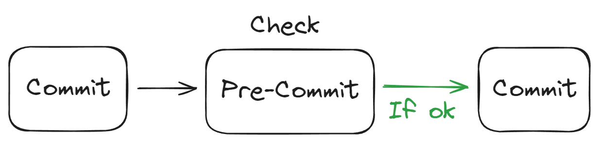

# Pre-commit
O pre-commit é utilizado para validar se o commit está de acordo com as regras estabelecidas.

## Arquitetura


## Como baixar o projeto?
Clone o repositório
```
git clone https://github.com/wlcamargo/pre-commit
```
Entre na pasta do projeto
```
cd pre-commit
```

## Como instalar?

Crie o ambiente virtual
```
python3 -m venv venv
```

Ative o ambiente virtual
```
source venv/bin/activate
```

Instale as dependências
```
pip install -r requirements.txt
```

Execute o comando para rodar o pre-commit
```
pre-commit run --all-files
```

## Quais checks são realizados?

1. trailing-whitespace
Repositório: https://github.com/pre-commit/pre-commit-hooks
ID: trailing-whitespace
Descrição: Remove espaços em branco no final das linhas. Espaços extras no final das linhas não são apenas desnecessários, mas também podem causar problemas em alguns sistemas e ferramentas de controle de versão.
2. check-added-large-files
Repositório: https://github.com/pre-commit/pre-commit-hooks
ID: check-added-large-files
Args: ['--maxkb=5000']
Descrição: Verifica se arquivos grandes (maiores que 5 MB, conforme configurado) foram adicionados ao repositório. Isso ajuda a evitar o commit de arquivos desnecessariamente grandes que podem afetar o desempenho do repositório.
3. check-yaml
Repositório: https://github.com/pre-commit/pre-commit-hooks
ID: check-yaml
Descrição: Verifica se os arquivos YAML estão bem formatados e válidos. Isso é importante para garantir que os arquivos de configuração YAML não contenham erros que possam causar falhas em sistemas que os utilizam.
4. check-json
Repositório: https://github.com/pre-commit/pre-commit-hooks
ID: check-json
Descrição: Verifica se os arquivos JSON estão bem formatados e válidos. Isso ajuda a evitar problemas com arquivos JSON malformados que podem causar erros em aplicações que os utilizam.
5. black
Repositório: https://github.com/psf/black
ID: black
Descrição: Aplica formatação automática de código conforme as regras do Black. Black é um formatador de código para Python que impõe uma formatação consistente e ajuda a manter o código limpo e legível.
6. isort
Repositório: https://github.com/pre-commit/mirrors-isort
ID: isort
Descrição: Organiza automaticamente as importações em arquivos Python. Isso ajuda a manter as importações organizadas e ordenadas de forma consistente, seguindo uma ordem padrão.
7. mypy
Repositório: https://github.com/pre-commit/mirrors-mypy
ID: mypy
Descrição: Realiza verificação de tipos no código Python usando o MyPy. Isso ajuda a identificar problemas de tipo e garantir que o código esteja conforme as anotações de tipo fornecidas.
8. pylint
Repositório: https://github.com/PyCQA/pylint
ID: pylint
Descrição: Executa o Pylint, uma ferramenta de linting que verifica o código para detectar erros, estilo, e outros problemas. O Pylint fornece um relatório detalhado sobre a qualidade do código e possíveis melhorias.
9. bandit
Repositório: https://github.com/PyCQA/bandit
ID: bandit
Args: ["--skip=B101"]
Descrição: Realiza uma análise de segurança estática no código Python para identificar vulnerabilidades. A opção --skip=B101 faz com que a verificação B101 (verificação de uso de funções de segurança em vez de funções inseguras) seja ignorada.


## Referências
https://github.com/pre-commit/pre-commit


## Developer
| Desenvolvedor      | LinkedIn                                   | Email                        | Portfólio                              |
|--------------------|--------------------------------------------|------------------------------|----------------------------------------|
| Wallace Camargo    | [LinkedIn](https://www.linkedin.com/in/wallace-camargo-35b615171/) | wallacecpdg@gmail.com        | [Portfólio](https://wlcamargo.github.io/)   |
